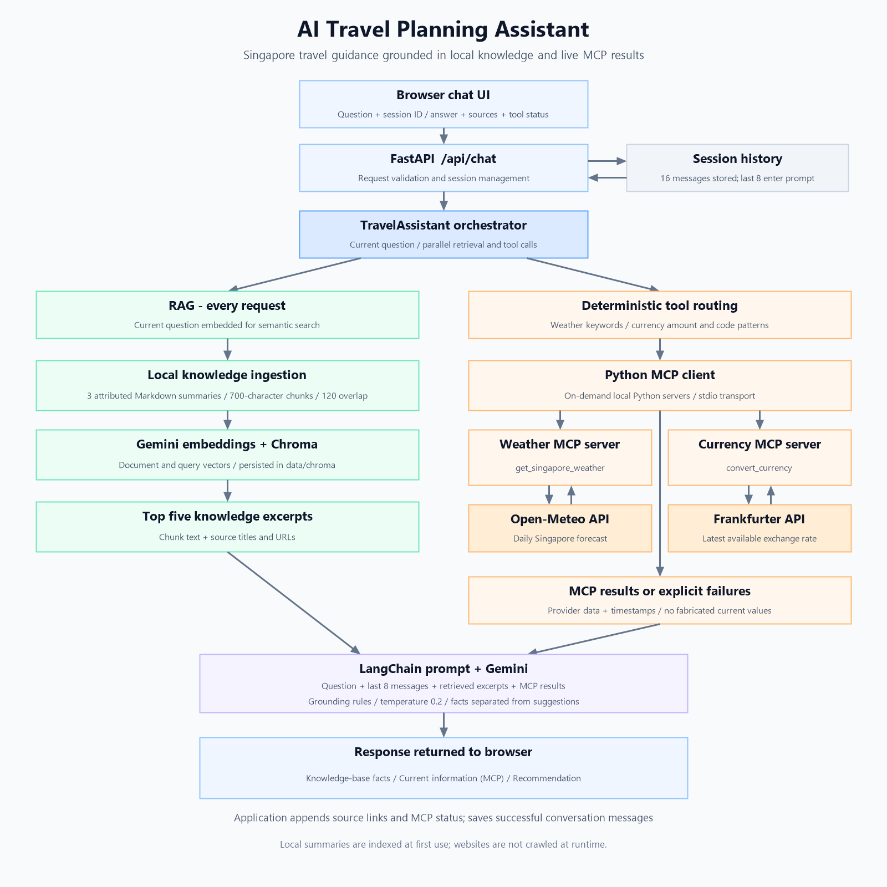

# AI Travel Planning Assistant

A Singapore travel assistant that combines a local knowledge base, retrieval-augmented generation (RAG), and live weather and currency tools through the Model Context Protocol (MCP). A FastAPI browser interface presents Gemini-generated recommendations, source links, and tool status.

## Demo Video

**Video link:** Coming soon — add the demo video link here.

See the [demo walkthrough](docs/demo.md) for the demonstration steps.

## Architecture



Retrieval and required tool calls run concurrently. For each tool call, the application starts a local Python subprocess, initializes an MCP stdio session, calls the named tool, and closes the connection. No separate MCP server startup is needed.

| Component | Responsibility | Files |
| --- | --- | --- |
| Browser UI | Sends questions and session ID; displays answers, sources, and MCP status | `public/index.html`, `public/app.js`, `public/styles.css` |
| FastAPI | Serves the UI, validates chat requests, and manages history | `app/main.py` |
| Orchestrator | Combines retrieval, tools, prompt, and model output | `app/assistant.py` |
| RAG | Loads documents, embeds chunks, and searches Chroma | `app/rag.py` |
| MCP client | Detects tool requests and invokes local servers | `app/mcp_servers.py` |
| MCP servers | Retrieve weather and exchange rates | `mcp_servers/weather_server.py`, `mcp_servers/currency_server.py` |
| Prompt | Defines grounding and response rules | `app/prompts.py` |

## Knowledge-base sources

The knowledge base contains three original study summaries attributed to three pages from two publishers. The application reads local Markdown files; it does not crawl or refresh the websites at runtime.

| Local document | Attributed source | Coverage |
| --- | --- | --- |
| [01-wikivoyage-singapore.md](knowledge/01-wikivoyage-singapore.md) | [Singapore travel guide - Wikivoyage](https://en.wikivoyage.org/wiki/Singapore) | Districts, attractions, food, transport, and itinerary ideas |
| [02-visit-singapore-essentials.md](knowledge/02-visit-singapore-essentials.md) | [Essential Singapore Travel Information - Visit Singapore](https://www.visitsingapore.com/travel-tips/essential-travel-information/) | Climate, language, visitor essentials, transport, and accessibility |
| [03-visit-singapore-itinerary.md](knowledge/03-visit-singapore-itinerary.md) | [Enjoy Singapore in 7 Days - Visit Singapore](https://www.visitsingapore.com/travel-tips/travelling-to-singapore/itineraries/7-days-in-singapore/) | Itinerary building blocks, rain alternatives, family activities, and food planning |

Each document has front matter containing `title`, `url`, and `license_note`. The loader adds `filename`; chunking preserves this metadata. The application deduplicates source URLs from retrieved chunks and displays them below the answer. These links identify retrieved sources; they are not independent verification of every generated claim.

To extend the knowledge base, add or update a Markdown document in `knowledge/` using the same front-matter format. At least three documents are required. Preserve attribution and rebuild the index after changes as described below.

## RAG workflow

1. **Load:** On the first question in an application process, read all `knowledge/*.md` documents and parse their front matter.
2. **Split:** Use LangChain's `RecursiveCharacterTextSplitter` with **700-character chunks** and **120-character overlap**.
3. **Embed:** Generate document embeddings using `GoogleGenerativeAIEmbeddings`, with `models/gemini-embedding-001` as the repository default.
4. **Index:** Store chunks and metadata in the Chroma collection `singapore_travel`, persisted under `data/chroma/`.
5. **Retrieve:** Embed the current question and retrieve the **top five chunks** using similarity search. The returned relevance scores are not used as a filtering threshold.
6. **Enrich and generate:** Combine retrieved excerpts, any MCP results, recent conversation history, and the current question in a LangChain prompt. Invoke the Gemini chat model.
7. **Present and remember:** Return `answer`, `sources`, and `currentInfo`; retain the successful user and assistant messages for subsequent requests.

RAG runs on every request, including currency-only requests. Retrieval uses the current question directly; history is supplied to generation but does not rewrite the retrieval query.

**Index lifecycle:** The initialized store is reused during the process lifetime. After a restart, initialization calls `Chroma.from_documents` again even though vectors are persisted, so duplicate chunks can accumulate. To rebuild after document or embedding-model changes, stop the application, remove only the generated `data/chroma/` directory, and restart. The next question creates the index again.

## MCP tools

Both servers use the Python MCP SDK and `FastMCP`. The client launches them with the same Python executable as the application and parses JSON returned through MCP text content. Neither provider requires an API key in this implementation.

| Tool | Inputs | Provider and output |
| --- | --- | --- |
| `get_singapore_weather` | `start_date`: optional ISO date; `days`: integer, default `3`, allowed `1-7` | Open-Meteo: Singapore daily conditions, minimum/maximum Celsius temperatures, maximum precipitation probability, provider, and retrieval timestamp |
| `convert_currency` | Positive `amount`; `source` and `target` currency codes | Frankfurter: converted amount rounded to two decimals, rate, rate date, provider, and retrieval timestamp. Same-currency conversion returns the input amount and rate `1` without an API call. |

### Tool routing

- **Weather trigger:** The current question contains `weather`, `forecast`, `rain`, `rainy`, `outdoor`, `indoor`, `tomorrow`, or `next week`.
- **Weather dates:** An explicit `YYYY-MM-DD` takes priority. Otherwise, `next week` means the next Monday, `tomorrow` means the following day, and the default is today in Singapore time (UTC+8).
- **Forecast duration:** The router requests three days for `three-day`, `three day`, `3-day`, `3 day`, or `next week`; otherwise it requests one day. Use “Give me a three-day weather forecast.” The wording “next three days” currently selects one day.
- **Forecast range:** The server is intended for dates within the next 16 forecast days. Invalid or unavailable dates produce a tool error.
- **Currency trigger:** Regex patterns accept `INR`, `USD`, `SGD`, `EUR`, and `GBP`, with syntax such as `INR 50,000 to SGD` or `200 SGD in INR`. Supported separators are `to`, `into`, and `in`.

Tool selection is deterministic, rather than chosen by the model. Routing uses only the current message, so follow-up requests should repeat required dates, amounts, and currency codes.

Each provider HTTP request has a 15-second timeout. Tool failures are passed to the prompt and displayed as unavailable in the UI. The prompt instructs the model not to invent missing weather or rates. Embedding or answer-generation failures return HTTP `503` from the chat endpoint.

## Prompt and context strategy

[app/prompts.py](app/prompts.py) defines a system instruction and a human message with four labeled inputs: conversation history, current request, knowledge-base excerpts, and MCP results. The chat model uses temperature **0.2**.

| Strategy | Prompt behavior |
| --- | --- |
| Ground destination facts | Use only retrieved excerpts for destination claims. |
| Ground current information | Use only MCP results for weather and exchange rates; identify the provider and report tool failures. |
| Handle insufficient evidence | State when the knowledge base is insufficient. Do not guess opening hours, prices, bookings, visas, or route details. |
| Retain user preferences | Consider family, cultural, budget, date, and indoor preferences in recent history. Ask one focused follow-up only when necessary. |
| Separate facts and suggestions | Use **Knowledge-base facts**, **Current information (MCP)**, and **Recommendation** sections. Omit the MCP section when no current information was requested. Label recommendations as suggestions and include indoor alternatives when rain warrants them. |
| Control source links | Instruct the model not to generate a sources section; append links from retrieved metadata in the application. |

The server retains up to **16 messages** per session, while the prompt receives the **last eight messages**, normally four user/assistant exchanges. History lives in server memory and is lost on restart. The browser generates a new session ID on each page load, so refreshing starts a new conversation. There is no long-term memory or history summarization. Grounding is enforced through prompt instructions, without a separate factual-validation stage.

## Setup instructions

### Prerequisites

- Git.
- Python **3.11 or later** and `pip`.
- A Gemini API key with access to the configured chat and embedding models.
- Internet connectivity for Gemini, Open-Meteo, and Frankfurter.

### 1. Clone the repository branch

Clone the `master` branch and enter the project directory:

```bash
git clone https://github.com/sanjayN4497/Sanjay_Nandaniya_3213327_NAGP_AI_ML_2026.git

cd Sanjay_Nandaniya_3213327_NAGP_AI_ML_2026
```

Run all remaining commands from this project directory.

### 2. Create and activate a virtual environment

Windows PowerShell:

```powershell
python -m venv .venv
.\.venv\Scripts\Activate.ps1
```

macOS/Linux:

```bash
python3 -m venv .venv
source .venv/bin/activate
```

If PowerShell blocks activation, use `.\.venv\Scripts\python.exe` instead of `python` in subsequent commands.

### 3. Install dependencies

```bash
python -m pip install -r requirements.txt
```

The project uses FastAPI, Uvicorn, LangChain, Gemini integration, Chroma, the MCP SDK, HTTPX, and python-dotenv. The browser UI uses plain HTML, CSS, and JavaScript; no frontend build step is required.

### 4. Configure environment variables

If `.env` does not already exist, copy the template:

```powershell
Copy-Item .env.example .env
```

On macOS/Linux, use `cp .env.example .env`. Edit `.env`:

```dotenv
GOOGLE_API_KEY=your_gemini_api_key
GEMINI_MODEL=gemini-3.6-flash
GEMINI_EMBEDDING_MODEL=models/gemini-embedding-001
PORT=3000
```

| Variable | Purpose |
| --- | --- |
| `GOOGLE_API_KEY` | Used for embeddings and generation. `GEMINI_API_KEY` is accepted as a fallback. |
| `GEMINI_MODEL` | Chat model; repository default is `gemini-3.6-flash`. Choose a model available to your account if necessary. |
| `GEMINI_EMBEDDING_MODEL` | Embedding model; repository default is `models/gemini-embedding-001`. |
| `PORT` | Used by `python -m app.main`; defaults to `3000`. The Uvicorn command below uses its explicit `--port` argument. |

The application loads the project-local `.env` with precedence over matching shell variables. `.env` and generated `data/` files are excluded by `.gitignore`.

### 5. Start the application

```bash
python -m uvicorn app.main:app --reload --port 3000
```

Open [http://localhost:3000](http://localhost:3000). The first question takes longer while embeddings and the vector store initialize. MCP servers start automatically when requested. Stop the application with `Ctrl+C`.

### 6. Verify the setup

Open [the health endpoint](http://localhost:3000/api/health). `{"geminiConfigured": true}` indicates that a key is present; it does not validate the key, model access, or connectivity. Interactive API documentation is at [http://localhost:3000/docs](http://localhost:3000/docs).

Try these questions in the same browser session:

| Capability | Example |
| --- | --- |
| RAG | “Which neighbourhoods are suitable for cultural experiences?” |
| Weather MCP | “Give me a three-day weather forecast for Singapore.” |
| Currency MCP | “Convert INR 50,000 to SGD.” |
| Combined RAG and MCP | “Plan a three-day Singapore itinerary for next week and adjust it according to the weather forecast.” |
| Conversation context | First: “I am travelling with two children and prefer cultural activities.” Then: “Now plan a three-day itinerary for next week.” |

Check for source links below answers and provider status on tool requests. Additional material: [sample questions and responses](docs/sample-questions-and-responses.md) and [demo walkthrough](docs/demo.md).

### Troubleshooting

| Symptom | Action |
| --- | --- |
| Missing API key or HTTP `503` | Set the key in `.env`, restart, and inspect the returned error. |
| Model unavailable or quota error | Check configured model names, account access, and API quota. |
| Weather or currency unavailable | Check network connectivity, tool errors, forecast dates, and conversion syntax. |
| Stale or duplicate retrieval | Stop the app and remove the generated `data/chroma/` directory before restarting to rebuild it. |
| Preferences disappear | Keep the same page open and repeat preferences outside the eight-message prompt window. |

## Project structure

```text
.
|-- app/
|   |-- main.py                 # FastAPI routes and session history
|   |-- assistant.py            # Retrieval, tools, and generation
|   |-- rag.py                  # Document ingestion and vector search
|   |-- mcp_servers.py          # Intent routing and MCP client
|   `-- prompts.py              # Grounded answer template
|-- mcp_servers/
|   |-- weather_server.py       # Open-Meteo tool
|   `-- currency_server.py      # Frankfurter tool
|-- knowledge/                  # Three attributed Markdown summaries
|-- public/                     # Browser UI
|-- docs/                       # Sample responses and demo
|-- data/chroma/                # Generated vector store (gitignored)
|-- .env.example                # Configuration template
|-- requirements.txt            # Python dependencies
`-- README.md
```
